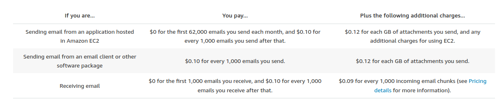

Here I will tell you about how you can get the production access for the AWS SES. If you have any website and you want to send emails to your users and want to get so many subscribers to your blog or for your website then its good choice to send them emails and remind them about your website. So there are so many websites which will provide you this type of services for email marketing. But some of them are very expensive and some of them are cheaper. Here we are choosing AWS Simple E-mail service beacause its pricing is not much as compare to other services.

## Pricing for  AWS SES

For sending emails from AWS SES you need to a AWS account and in this account you don't have any production access to your SES service but its the sandbox access means that you can only send emails to the verified emails in the SES dashboard so you have to request higher sending quotas for email.

